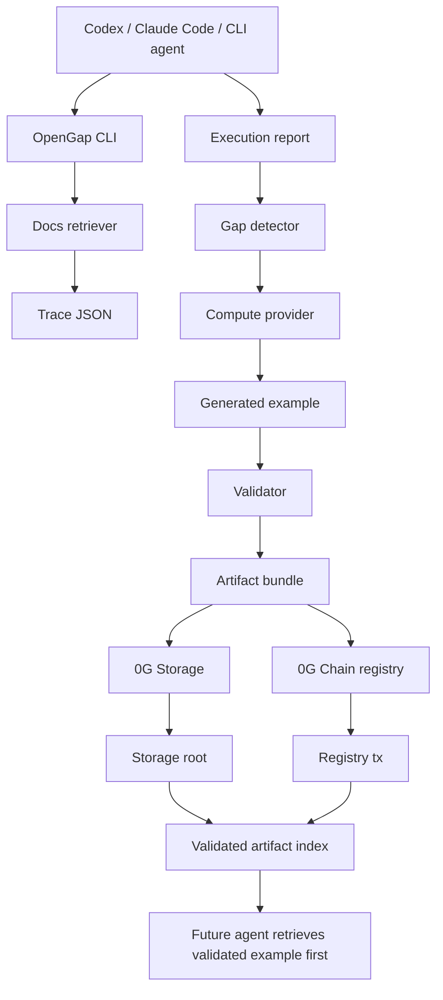

# Architecture

OpenGap is a framework loop for turning failed coding-agent executions into validated, reusable artifacts with 0G provenance.

## Core Objects

- `Trace`: question, retrieved docs, source snapshot hash, answer, model metadata.
- `Execution`: command/action attempted by the coding agent and the observed failure.
- `Gap`: the inferred missing doc, example, error decoder, or agent skill.
- `ComputeEvent`: reflection/generation provider metadata and input/output hashes.
- `Artifact`: generated example or doc patch.
- `Validation`: deterministic command output proving the artifact works.
- `ImprovementRecord`: provenance record tying trace, source snapshot, artifact, validation, 0G Storage root, and 0G Chain tx together.
- `ValidatedArtifactIndex`: retrieval layer future agents use before raw docs.

## 0G Usage

- 0G Storage: stores artifact bundles and validation evidence.
- 0G Chain: records improvement commitments through `OpenGapRegistry`.
- 0G Compute: implemented as a provider interface; the current demo uses a local 0G-shaped stub and records compute events.

